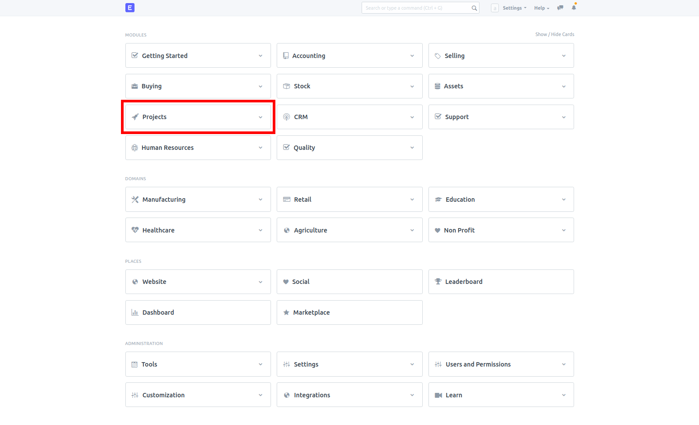
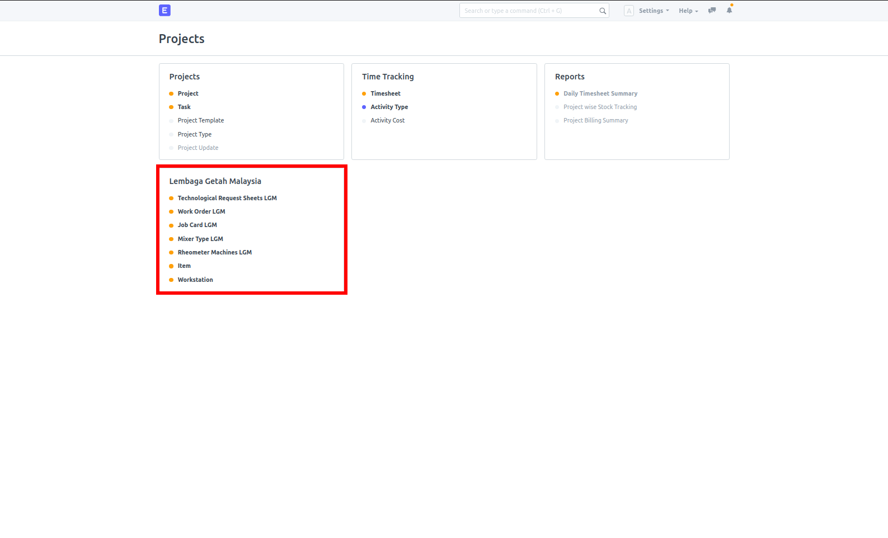

# ERPNext with LGM
<a href="https://github.com/chiajunshen/shrdc_custom_frappe_docker/blob/master/LICENSE">
    
</a>
<a href="https://github.com/chiajunshen/shrdc_custom_frappe_docker/releases">
    
</a>
<a href="https://github.com/chiajunshen/shrdc_custom_frappe_docker/releases">
    
</a>
<a href="https://github.com/chiajunshen/shrdc_custom_frappe_docker/issues">
      
</a>
<a href="https://github.com/chiajunshen/shrdc_custom_frappe_docker/pulls">
    
</a>

<br>

# ERPNext Home Page



<br>

## Important Details
This is a deployment repository - It only contains files needed for Docker deployment, not code for ERPNext LGM. In other words, this repository is what allows you to run ERPNext LGM, but the code isn't kept here.

The production repository with code is here: https://github.com/msf4-0/ERPNext-LGM-Code.

For how to mount the production repository's version into the system, please refer to the "For Developers" section below.

## For ERPNext User

### Workflow Guide
Please refer to this repository's Wiki (deprecated): https://github.com/msf4-0/ERPNext-LGM/wiki.

IMPORTANT: Do not fully follow the Wiki above, as it is based on a version that was halfway through an overhaul, and has since been deprecated. Many features and instructions there may no longer apply to the current version.

### 1. ERPNext with LGM Modules
1. Prerequisites:
    - Windows: Docker Desktop
    - Ubuntu: Docker Engine, Docker Compose
    - Mac: Docker Desktop

2. The installation of this release includes the following:
    - [ERPNext Version 12](https://github.com/frappe/erpnext)

3. For Windows & MacOS user, start from `Section 3`.
4. For Ubuntu user, start from `Section 4`.

### 2. Pre-Setup: Windows/MacOS
1. The setup guide is tested to work on `Windows 10`, `Ubuntu 18.04` and `macOS Mojave 10.14.6`

2. For Windows and MacOS, create a folder.

3. Open a Powershell terminal, navigate to the newly created folder.

4. Go to `Section 5: Setup`.

### 4. Pre-Setup: Ubuntu
1. Open a terminal.

2. Create a user called `frappe`. (You can give a name of your preference to replace `frappe`)
    - `sudo adduser frappe`

3. You may be promted to give a password for the newly created user `frappe`. Remember this password, you will need it for the next step.

4. Log into the user `frappe`
    - `su - frappe`

5. Create a folder called `frappe_docker`. Again, folder name is of your preference. Navigate into the new directory.
    - `mkdir frappe_docker`
    - `cd frappe_docker`

6. Go to `Section 5: Setup`.

### 5. Setup

1. Clone this repo.
    - `git clone https://github.com/msf4-0/ERPNext-LGM`

2. Navigate to the cloned folder.
    - `cd ERPNext-LGM`

3. In `env-example`, you can change the variables that would be used in this installation process to your preference such as the following:
    - Server port to host ERPNext,`ERPNEXT_SERVER_PORT`. Default is `8000`.
    - Database port,`MARIADB_SERVER_PORT`. Default is `3306`.
    - Site name `SITE_NAME`. Default is `custom-erpnext-nginx`.
    
    Note: 
    - You can leave these variables as it's provided if all the specified ports are not occupied.
    - Upon successful setup, you can access ERPNext via port number `ERPNEXT_SERVER_PORT`.
    - For Metabase Integration, you would need to connect to Mariadb via `MARIADB_SERVER_PORT`.

4. Copy environment variables from the `env-example` file into `.env` file using this command `cp env-example .env`.

5. Start all the docker containers by this command `docker compose -p <project_name> up -d`.
    
    Note: 
    - Replace `<project_name>` to your preference.
    - For example, `docker compose -p project1 up -d`

6. Monitor the site creation progress by logging into the `<project_name>-site-creator-1` container. To do this step, use this command `docker logs <project_name>-site-creator-1 -f`. The site creation process might take up to 5 minutes - This is normal.
    
    - If the site creator container seems to be stuck in a restarting loop, or is still not ready after a while, consider running `docker compose down` then `docker compose up -d` again.
      
      If the error still persists, run `docker compose down -v` instead. (IMPORTANT: This will wipe the container's volumes, including any data stored inside the container.)

7. After the `<project_name>-site-creator-1` container display `Scheduler is disabled`, login to `<project_name>-erpnext-python-1` container. Use `docker exec -it --user root <project_name>-erpnext-python-1 /bin/bash` to login into this container as a root user.
    
8. Once you login in into `<project_name>-erpnext-python-1` container, by default, you will be in the `~:/home/frappe/frappe-bench/sites` directory. Navigate out to `~:/home/frappe/frappe-bench` directory by typing `cd ..`.

9. Now, apply the new changes in Frepple app by running this command `bench --site <site_name> migrate`.
    
    Note:
    - Replace `<site_name>` to the same name as specified in the .env file. Refer to step 3 and 4.
    - For example, `bench --site custom-erpnext-nginx migrate`

10. After the process `Compiling Python files...` is finished, you will be back in the `~:/home/frappe/frappe-bench` directory. This means the `bench migrate` process is completed. Type `exit` to exit from `<project_name>-erpnext-python-1` container.

11. Now, you can open any browser such as `Google Chrome` and access ERPNext via `http://localhost:<ERPNext_Server_Port>` or `http://<Your_IP_address>:<ERPNext_Server_Port>`.
    
    Note:
    - Type the selected ERPNext port number in `<ERPNext_Server_Port>` selected in step 4. 
    - For example, `http://localhost:8000` or `http://127.0.0.1:8000`.

12. Default credentials.
    - Username: `Administrator`
    - Password: `admin`

13. To access the custom LGM doctypes, make sure your browser is first open at the `/desk` page. For example, if the URL is `http://localhost:8000`, go to `http://localhost:8000/desk`. Then, select the "Projects" section, and open the Doctypes under "Lembaga Getah Malaysia". These menu options can be seen in the images at the top of this repo. Do note that you might need to manually go back to the desk page when opening the page sometimes, so this please remember this step for future reference.

### 6. Stopping Docker Containers
1. To stop all the docker containers related to your `<project-name`> project:
    - Open a Powershell terminal, navigate to `ERPNext-LGM` folder.
    - Run `docker compose -p <project-name> stop`. 
    - For example, `docker compose -p project1 stop`.

### 7. Starting Docker Containers
1. To start up all the docker containers related to your `<project-name`> project:
    - Open a Powershell terminal, navigate to `ERPNext-LGM` folder.
    - Run `docker compose -p <project-name> start`. 
    - For example, `docker compose -p project1 start`.

### 8. Deleting Docker Containers
1. To remove all the docker containers related to your `<project-name`> project:
    - Open a Powershell terminal, navigate to `ERPNext-LGM` folder.
    - Run `docker compose -p <project-name> down` or run `docker compose -p <project-name> down -v` to remove the related Docker Volume.
    - For example, `docker compose -p project1 down -v`

## Update Custom App
1. Assumptions:
    1. You have a running instance of ERPNext in docker production container.
2. [How to update custom app](https://docs.google.com/document/d/1XCfNE1SoWK3MvIFHlthTw0GBUqfyAD66YM2hoO62CjU/edit?usp=sharing)

## Backup
1. Assumptions:
    1. You have a running instance of ERPNext in docker production container.
2. Alternatives:
    1. [Online Backup (Automatic)](https://docs.google.com/document/d/1nFbnYwB1hkFBeqMrb35IOHjo7M4PF9sRGHR08TtVJ6w/edit?usp=sharing)
    2. [Local Backup (Manual)](https://docs.google.com/document/d/1x_-71FcPrrhF7vvuBX37G0No-TlPxyTQNcQWuN0f8cE/edit?usp=sharing)
    3. [Local Backup (Automatic)](https://docs.google.com/document/d/1Is8J244t_-t4Ue4bbgPr0Y4P20-0wFKE5IkGEPYU-cE/edit?usp=sharing)

## Restore
1. Assumptions:
    1. You have your backup files on your pc (if you perform online backup, you can download the backup files onto your pc).
    2. You have a running instance of ERPNext in docker production container in which you want to restore with the backup files.
2. [Restore](https://docs.google.com/document/d/1yG2N1isESsdtDdfH3aHykIrgD6lnVOLzK0zThKLreHA/edit?usp=sharing)

<br>

## For Developers - Mounting code from production repository

### 1. Cloning
Clone the production repository (link at the top of document) into the same parent folder as this repository. It should look like this:

```
parent_folder
|-> erpnext_lgm (current repository folder)
|-> erpnext_lgm_code (production repository folder)
```

If you can't keep both in the same parent folder, it is still possible to run, but you need to update the "PROD_REPO_PATH" relative path in the .env file later to point to your production repository folder.

### 2. Set up
Copy the env-example file as .env, and change the environment variables if desired.

### 3. Run
To mount the production repository folder, an override .yml file is provided as "docker compose.dev.yml". You can either run `docker compose -f docker compose.yml -f docker compose.dev.yml up -d`, or use the provided scripts "dev.cmd" (for Windows), or "dev.sh" (for Linux) for convenience. 

However, please ensure you inspect the scripts before running them, especially when pulling new commits from this repository. Ensure you understand what the scripts do before running them for security reasons.

To use the convenience scripts, just call the corresponding script for your operating system, and then add the Docker compose arguments you need, for example:

- `docker compose -f docker compose.yml -f docker compose.dev.yml up -d` → `.\dev.cmd up -d`
- `docker compose -f docker compose.yml -f docker compose.dev.yml down -v` → `.\dev.cmd down -v`

However, these convenience scripts also have a "setup" option which automatically enables developer mode and runs `bench migrate` automatically. It is highly recommended to use this instead of `docker compose up` to ensure that changes made to the code show up every time the container is created, and for Doctype schema changes to show up as .json files. To run it, replace the Docker compose argument with `setup`, i.e. :
`.\dev.cmd setup`.

### Finding the name of the backend container (Default: `erpnext-lgm-erpnext-python-1`)
1) Find the name of your backend service. This can be found in your Docker .compose file (not .dev.compose). If you did not change your compose file, it should be `erpnext-python`. Look for the service that contains the following parameter: `image: ${DOCKER_USERNAME}/custom-erpnext-worker:${ERPNEXT_VERSION}`, and contains the the following line under its `environment` field:\
    `environment:`\
      `- MARIADB_HOST=${MARIADB_HOST}`
2) Find the name of your process. If you started your Docker compose without the -p flag, it should be `erpnext-lgm` by default.
3) Ensure that your ERPNext system is up and running. With both the backend name from 1) and the process name from 2), open your computer's terminal and type `docker ps` to list all running Docker containers. Under the `NAMES` column, look for a name that starts with this: `<PROCESS NAME>-<SERVICE NAME>`. The container name that starts with this name is the backend container.

    - For example, the default process name is `erpnext-lgm` and the default process name is `erpnext-python`, so combined they are `erpnext-lgm-erpnext-python`. The only container that starts with this name is `erpnext-lgm-erpnext-python-1`. Thus, `erpnext-lgm-erpnext-python-1` is the name of the backend container.

### Finding the name of the site (Default: `custom-erpnext-nginx`)
1) Access the backend bash terminal using the method below.
2) Run `cd ~/frappe-bench/sites`
3) Run `ls -d */`
4) From the options listed, if you didn't create a new site before this, there should be only 2 options listed in blue - each one represents a folder. Look for the folder that isn't named "assets", that is the name of the site. For example, by default, only `assets` and `custom-erpnext-nginx` will be shown - `custom-erpnext-nginx` is the name of the site.

### Accessing the backend bash terminal / bench console
- Backend bash terminal → run `docker exec -it <BACKEND CONTAINER NAME> bash`. Since the default backend container name is `erpnext-lgm-erpnext-python-1`, the default command would be `docker exec -it erpnext-lgm-erpnext-python-1 bash`.
- Bench console -> Access the backend bash terminal using the method above first, then run `bench --site <SITE NAME> console`. Since the default site name is `custom-erpnext-nginx`, the default command would be `bench --site custom-erpnext-nginx console`.

To exit from either terminal, just run `exit`.

### Reflecting latest changes
There are 3 main types of changes, backend changes (.py or config.json files), database/Doctype schema changes (.json files), and frontend changes (.js files).
- Backend changes -> Restart the container using `./dev.cmd restart`
- Database/Doctype schema changes -> `.\dev.cmd exec erpnext-python bench --site all migrate` (replace erpnext-python with backend service name defined in the Docker compose file if changed)
- Frontend changes -> Normally requires bench build, but first try the following steps, and if one doesn't work, try the next:
    1) Clear the cache by running `ctrl + shift + r` in the web browser
    2) Open the bench console using the method mentioned earlier, then run
       `frappe.reload_doc("projects", "doctype", "<DOCTYPE_NAME>", force=True)`\
       `frappe.db.commit()`

       For example, to refresh the `ingredients_weighing_table_lgm` Doctype, run:\
       `frappe.reload_doc("projects", "doctype", "ingredients_weighing_table_lgm", force=True)`\
       `frappe.db.commit()`

## For Developers - Creating your own Docker Image
- [Reference: Customizing your own shrdc custom frappe docker](https://docs.google.com/document/d/1XxOYM_qhZ0RGI60YM82XHOkEzrn8ywXC98i354Donjc/edit?usp=sharing)

### 1. Introduction

- Fork this repo to build your own image with ERPNext and list of custom Frappe apps.
- Change `nginx/Dockerfile` and add required apps. Refer comments in the file.
- Change `worker/Dockerfile` and add required apps.

Example file uses following apps:

- [Metabase Integration](https://github.com/chiajunshen/shrdc_frappe_metabase)
- [Telegram Integration](https://github.com/chiajunshen/shrdc_erpnext_telegram)
- [Enhanced Frepple Integration](https://github.com/msf4-0/ERPNext-Frepple-Enhanced-Integration)
- [Barcode Scanning System](https://github.com/leexy0/barcode_shrdc)
- [Autocount](https://github.com/msf4-0/ERPNext-Autocount-Integration)
- [SQL Account](https://github.com/msf4-0/ERPNext-SQL-Accounting-Integration)

### 2. Build images

Execute from root of app repo.

For nginx:

```shell
# For version-12
docker build --build-arg=FRAPPE_BRANCH=version-12 --build-arg=GITHUB_OWNER=<github-username> -t custom-erpnext-nginx:v12 nginx

# Example:
docker build --build-arg=FRAPPE_BRANCH=version-12 --build-arg=GITHUB_OWNER=msf4-0 -t custom-erpnext-nginx:version-12 nginx
```

For worker:

```shell
# For version-12
docker build --build-arg=FRAPPE_BRANCH=version-12 --build-arg=GITHUB_OWNER=<github-username> -t custom-erpnext-worker:version-12 worker

# Example:
docker build --build-arg=FRAPPE_BRANCH=version-12 --build-arg=GITHUB_OWNER=msf4-0 -t custom-erpnext-worker:version-12 worker
```

### 3. Push images to Docker Hub
1. Tag the images bulilt from Step 2 with the format: 
`docker tag <Image Name>:<Version> <Docker Hub Username>/<Image Name>:<Version>`

For nginx:
```shell
docker tag custom-erpnext-nginx:version-12 shrdc/custom-erpnext-nginx:version-12
```

For worker:
```shell
docker tag custom-erpnext-worker:version-12 shrdc/custom-erpnext-worker:version-12
```

Reference: [Steps to create a Docker Hub, and push images to it.](https://docs.docker.com/get-started/04_sharing_app/)

2. To push to Docker Hub, run `docker push` with the tagged name created before. 

```shell
docker push shrdc/custom-erpnext-nginx:version-12
docker push shrdc/custom-erpnext-worker:version-12
```

3. Possible troubleshoot:
When you face `denied: requested access to the resource is denied` when pushing images, run `docker login` and enter your credentials. Then push image again.

### 4. (Optional) Configure `env-example`
1. You may need to change the `DOCKER_USERNAME` in `env-example` to the username of the Docker Hub account in which you have pushed your images to.
2. Copy `env-example` into `.env` by running `cp env-example .env`.

### 5. Start up
1. The following commands should be executed on the `~/some/path/ERPNext-LGM` directory
2. `docker compose -p <project_name> up -d`
3. `docker logs <project_name>_site-creator_1 -f`
4. After the `site_creator` container exited, open a browser, you can access ERPNext on `localhost:8000` or `127.0.0.1:8000`.
5. You can push the changes back to this repo (or your own repo if you forked one from this repo).

## License

This software is licensed under the [GNU GPLv3 LICENSE](/LICENSE) © [Selangor Human Resource Development Centre](http://www.shrdc.org.my/). 2021.  All Rights Reserved.
